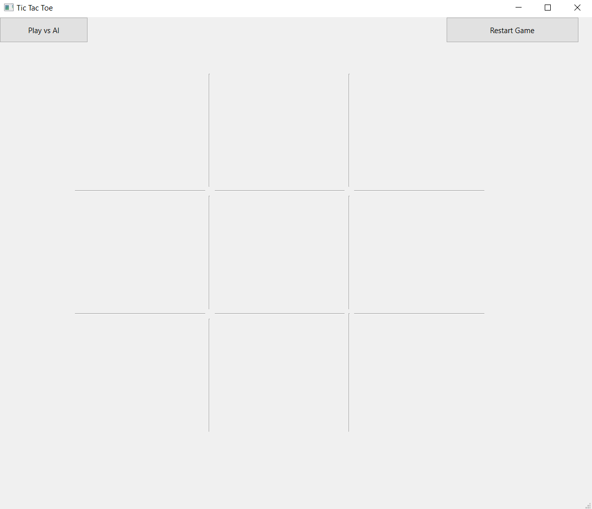

# Qt Tic-Tac-Toe with AI

A modern implementation of the classic Tic-Tac-Toe game built with Qt, featuring both Player vs Player and Player vs AI modes. The AI opponent uses the Minimax algorithm to make optimal moves.




## Features

- Clean and intuitive user interface
- Two game modes:
  - Player vs Player
  - Player vs AI
- Unbeatable AI using the Minimax algorithm
- Modern flat design with hover effects
- Instant visual feedback
- Game state tracking
- Easy restart functionality

## Technical Details

### AI Implementation
The game implements the Minimax algorithm for the AI opponent, making it effectively unbeatable. The AI:
- Evaluates all possible future moves
- Assumes optimal play from both players
- Chooses the move that maximizes its chances of winning while minimizing the opponent's chances

### User Interface
- Built with Qt 6
- Responsive grid layout
- Custom styled buttons with hover effects
- Clear game state indicators
- Smooth transitions between moves

## Building from Source

### Prerequisites
- Qt 6.x
- C++ compiler with C++11 support
- Qt Creator (recommended) or CMake

### Build Steps

1. Clone the repository:
```bash
git clone https://github.com/YOUR_USERNAME/tictactoe-qt.git
cd tictactoe-qt
```

2. Open in Qt Creator:
- Open Qt Creator
- File -> Open File or Project
- Select the `.pro` file
- Configure project
- Click Build

### Manual Build
```bash
qmake
make
```

## Project Structure

```
tictactoe-qt/
├── src/
│   ├── main.cpp
│   ├── mainwindow.cpp
│   ├── mainwindow.h
│   └── mainwindow.ui
├── resources/
│   ├── x.png
│   └── o.png
├── README.md
└── tictactoe.pro
```

## Usage

1. Launch the application
2. Choose game mode:
   - Click "Play vs AI" button to play against the AI
   - Click "Play vs Player" for two-player mode
3. Make moves by clicking on the grid
4. Use "Restart Game" to start a new game
5. Switch modes at any time using the toggle button

## Contributing

Contributions are welcome! Please feel free to submit a Pull Request.

## License

This project is licensed under the MIT License - see the [LICENSE](LICENSE) file for details.

## Acknowledgments

- Qt Framework
- Minimax Algorithm implementation inspired by classic game theory
## License

This project is licensed under the [GNU Lesser General Public License v3.0 (LGPL-3.0)](LICENSE).